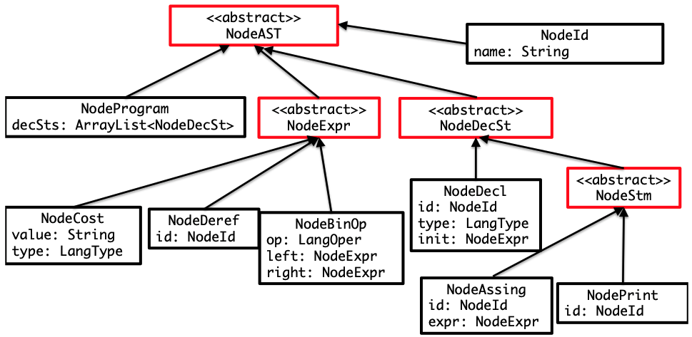

This image show the structure of the AST (Abstract Syntax Tree) used in the project. It illustrates how different components of the AST are interconnected and how they represent the syntax of the source code.

